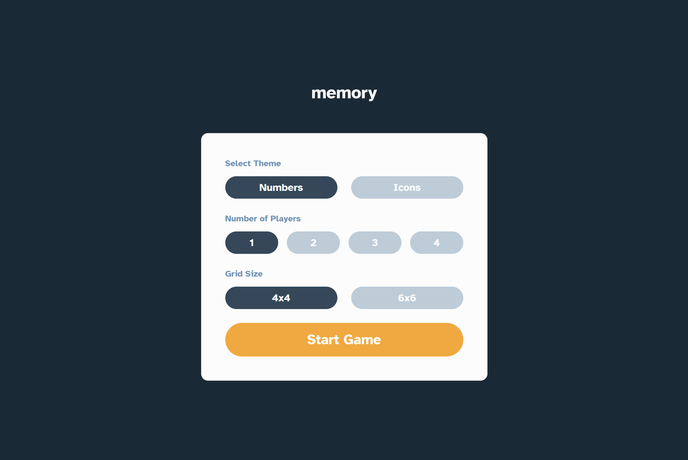
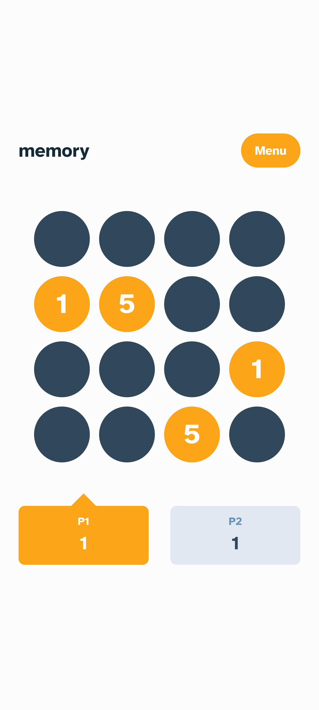

# Memory Game 🎮

A fun and interactive memory game built with **React**, **TypeScript**, and **Vite**. Test your memory skills by matching pairs of tiles in this modern and responsive game. Play solo or with friends and enjoy the engaging experience!

---

## 🚀 Features

- **Multiple Themes**: Choose between numbers or icons for the tiles.
- **Multiplayer Support**: Play solo or with multiple players.
- **Score Tracking**: Keeps track of moves and scores for all players.
- **Responsive Design**: Optimized for mobile, tablet, and desktop devices.
- **Dynamic Animations**: Smooth transitions and animations using `framer-motion`.
- **Customizable Themes**: Built with Tailwind CSS for easy styling.
- **Fast and Lightweight**: Powered by Vite for blazing-fast development and builds.

---

## 🛠️ Tech Stack

- **Frontend**: React + TypeScript
- **Styling**: Tailwind CSS
- **State Management**: Zustand
- **Animations**: Framer Motion
- **Build Tool**: Vite

---

## 📸 Screenshots

| Desktop View                                 | Mobile View                               |
| -------------------------------------------- | ----------------------------------------- |
|  |  |

---

## 🧩 Game Rules

The objective of the game is to match all pairs of tiles with the least number of moves.

- **Solo Mode**: Match all tiles as quickly as possible.
- **Multiplayer Mode**: Take turns to match tiles. The player with the highest score wins.

---

## 🏗️ Installation and Setup

Follow these steps to run the project locally:

### Prerequisites

- Node.js (v16 or higher)
- npm or yarn

### Clone the Repository

```bash
git clone https://github.com/pritamtirpude/meory-game-react
cd meory-game-react
```

### Install Dependencies

```bash
npm install
# or
yarn install
```

### Run the Development Server

```bash
npm run dev
# or
yarn dev
```

### Build for Production

```bash
npm run build
# or
yarn build
```

### Preview the Production Build

```bash
npm run preview
# or
yarn preview
```

---

## 📂 Project Structure

```plaintext
memory-game/
├── public/                 # Static assets (images, fonts, icons, etc.)
├── src/
│   ├── assets/             # Images
│   ├── components/         # Reusable React components
│   ├── store/              # Zustand store for state management
│   ├── App.tsx             # Main application component
│   ├── main.tsx            # Entry point
│   └── vite-env.d.ts       # TypeScript environment definitions
├── index.html              # HTML template
├── package.json            # Project metadata and dependencies
├── tailwind.config.js      # Tailwind CSS configuration
├── tsconfig.json           # TypeScript configuration
└── vite.config.ts          # Vite configuration
```

---

## 📦 Progressive Web App (PWA)

This project can be extended to include PWA features such as:

- Offline support with Workbox caching strategies.
- A manifest file for adding the app to the home screen.
- Responsive icons for different devices.

---

## 🤝 Contributing

Contributions are welcome! If you'd like to contribute:

1. Fork the repository.
2. Create a new branch:
   ```bash
   git checkout -b feature/your-feature-name
   ```
3. Commit your changes:
   ```bash
   git commit -m "Add your message here"
   ```
4. Push to the branch:
   ```bash
   git push origin feature/your-feature-name
   ```
5. Open a pull request.

---

## 📜 License

This project is licensed under the [MIT License](./LICENSE).

---

## 🙌 Acknowledgments

- Inspired by classic memory games.
- Built with love using React, TypeScript, and Vite.

---

## 📧 Contact

For any inquiries or feedback, feel free to reach out:

- **Author**: Pritam Tirpude
- **Email**: pritam.tirpude9601@gmail.com

---

Enjoy the game! 🎉
